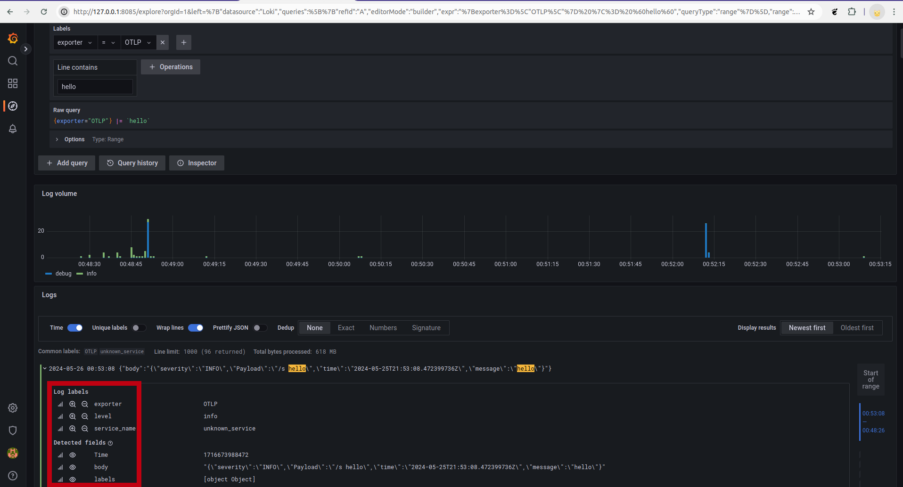
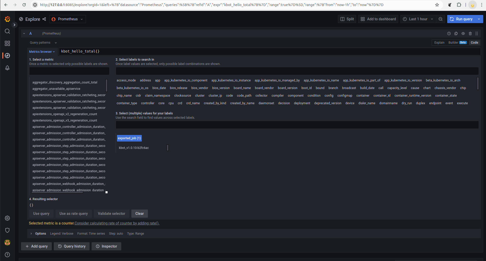
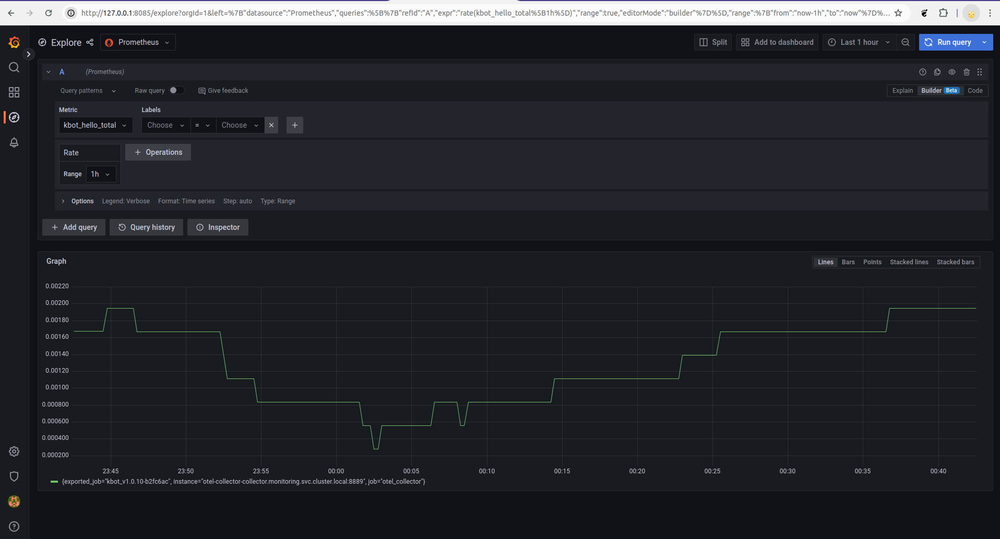

# flux-gitops-monitoring

## Deployment sequence for yamls

1. Monitoring namespace
2. Grafana source and release
3. Prometheus source and release
4. Loki release
5. Cert Manager source and release
6. Opentelemetry operator source and release
7. Opentelemetry collector yaml
8. Fluent-bit source and release
9. kbot-m secret in demo namspace with metrics address like "otel-collector-collector.monitoring.svc.cluster.local:4317"
10. Kbot source and release in demo namespace

## Log export options

### Fluent-bit => OTEL Collector => Loki

This approach works, but it was near to impossible to apply and forward k8s labels to log messages with OLTP collector processing:

### Fluent-bit => Loki

In this case, the default k8s labels applyed automatically:

## Metrics exporter

OTEL collector => Prometheus export works as expected:

