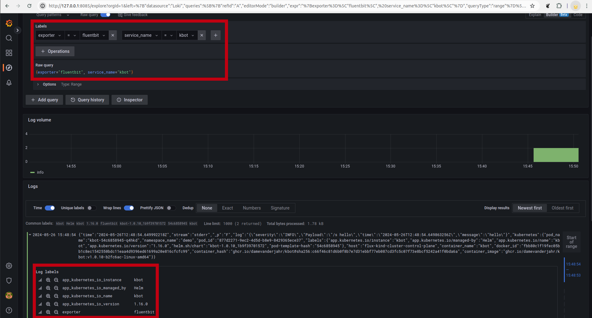

# flux-gitops-monitoring

## Deployment sequence for yamls

1. Monitoring namespace
2. Grafana source and release
3. Prometheus source and release
4. Loki release
5. Cert Manager source and release
6. Opentelemetry operator source and release
7. Opentelemetry collector yaml
8. Fluent-bit source and release
9. kbot-m secret in demo namspace with metrics address like "otel-collector-collector.monitoring.svc.cluster.local:4317"
10. Kbot source and release in demo namespace

## Log export options

### Fluent-bit => OTEL Collector => Loki

This approach works, but it was near to impossible to apply and forward k8s labels to log messages with OLTP collector processing:


### Fluent-bit => Loki

In this case, the default k8s labels applyed automatically:



## Metrics exporter

OTEL collector => Prometheus export works as expected:


## Pods and sevices

```sh
kubectl get po -n monitoring 
NAME                                            READY   STATUS    RESTARTS   AGE
cert-manager-6dc66985d4-78bx4                   1/1     Running   0          3h49m
cert-manager-cainjector-c7d4dbdd9-cgsb6         1/1     Running   0          3h49m
cert-manager-webhook-847d7676c9-z6ctm           1/1     Running   0          3h49m
fluent-bit-mtbsj                                1/1     Running   0          31m
grafana-d55fb5d59-hfrfk                         1/1     Running   0          4h12m
loki-0                                          1/1     Running   0          4h10m
loki-canary-42x6d                               1/1     Running   0          4h10m
loki-chunks-cache-0                             2/2     Running   0          4h10m
loki-results-cache-0                            2/2     Running   0          4h10m
opentelemetry-operator-56dcbf994f-jbx89         2/2     Running   0          3h47m
otel-collector-collector-86948cffdb-cvp9t       1/1     Running   0          49m
prometheus-kube-state-metrics-96f7f6548-gltwz   1/1     Running   0          3h51m
prometheus-node-exporter-smh72                  1/1     Running   0          3h51m
prometheus-pushgateway-bf4df7c57-56lfh          1/1     Running   0          3h51m
prometheus-server-74dfd5b6c8-5bl2z              2/2     Running   0          3h51m

kubectl get svc -n monitoring 
NAME                                  TYPE        CLUSTER-IP      EXTERNAL-IP   PORT(S)                      AGE
cert-manager                          ClusterIP   10.96.20.60     <none>        9402/TCP                     3h49m
cert-manager-webhook                  ClusterIP   10.96.114.204   <none>        443/TCP                      3h49m
fluent-bit                            ClusterIP   10.96.179.103   <none>        2020/TCP                     3h21m
grafana                               ClusterIP   10.96.221.207   <none>        80/TCP                       4h12m
loki                                  ClusterIP   10.96.227.95    <none>        3100/TCP,9095/TCP            4h10m
loki-canary                           ClusterIP   10.96.73.191    <none>        3500/TCP                     4h10m
loki-chunks-cache                     ClusterIP   None            <none>        11211/TCP,9150/TCP           4h10m
loki-headless                         ClusterIP   None            <none>        3100/TCP                     4h10m
loki-memberlist                       ClusterIP   None            <none>        7946/TCP                     4h10m
loki-results-cache                    ClusterIP   None            <none>        11211/TCP,9150/TCP           4h10m
opentelemetry-operator                ClusterIP   10.96.52.128    <none>        8443/TCP,8080/TCP            3h47m
opentelemetry-operator-webhook        ClusterIP   10.96.114.159   <none>        443/TCP                      3h47m
otel-collector-collector              ClusterIP   10.96.68.56     <none>        4317/TCP,3030/TCP,8889/TCP   3h35m
otel-collector-collector-headless     ClusterIP   None            <none>        4317/TCP,3030/TCP,8889/TCP   3h35m
otel-collector-collector-monitoring   ClusterIP   10.96.214.42    <none>        8888/TCP                     3h35m
prometheus-kube-state-metrics         ClusterIP   10.96.135.213   <none>        8080/TCP                     3h51m
prometheus-node-exporter              ClusterIP   None            <none>        9100/TCP                     3h51m
prometheus-pushgateway                ClusterIP   10.96.227.13    <none>        9091/TCP                     3h51m
prometheus-server                     ClusterIP   10.96.189.37    <none>        80/TCP                       3h51m
```
